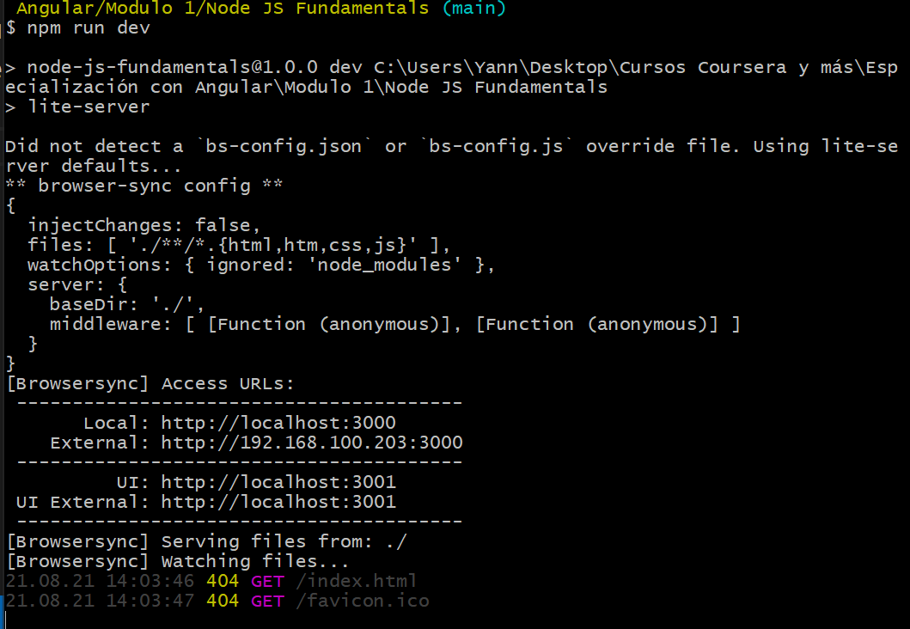
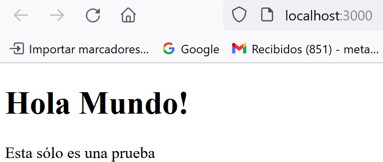

# Node JS Fundamentals:

Este es un repositorio que abordará todos los conocimientos básicos para adentrarse en Node JS.

Para comprobar la versión podemos colocar los comandos:

```
npm -v
node -v
```

## Configurando el servidor:

Para configurarlo hay que ingresar el comando `npm init` en realidad le diremos que es lo que hay en este proyecto, tecnicamente lo que hace es crear un paquete, en este caso es un **JSON** el cual incluirá toda la **metadata**, la **descripción**, algunas **tags**. Es información interesante para humanos como para que la computadora sepa de que se trata. 
Por defecto pone el nombre de la carpeta, pero esto puede cambiar:

```
Yann@DESKTOP-UUHP68N MINGW64 ~/Desktop/Cursos Coursera y más/Especialización con Angular/Modulo 1/Node JS Fundamentals (main)

$ npm init

This utility will walk you through creating a package.json file.
It only covers the most common items, and tries to guess sensible defaults.

See `npm help init` for definitive documentation on these fields
and exactly what they do.

Use `npm install <pkg>` afterwards to install a package and
save it as a dependency in the package.json file.

Press ^C at any time to quit.
package name: (node-js fundamentals)

```

Podemos dejar por defecto el nombre del proyecto, posteriormente nos despliega la versión y nos pide la descripción.

Cuando nos pide el entry point es aconsejable poner el `index.html` porque es lo primero que se lee, en este caso le ponemos un index.html porque trabajaremos sobre una web. Por el momento no se pondrá un comando de TEST por lo que se deja en blanco, se mantiene la ruta, no pondremos de momento keywords y definimos el autor, en este caso puede ser nuestro nombre. La licencia la dejamos por default y al final nos muestra un resumen de como quedó el archivo de configuración en un formato JSON.

```
$ npm init
This utility will walk you through creating a package.json file.
It only covers the most common items, and tries to guess sensible defaults.

See `npm help init` for definitive documentation on these fields
and exactly what they do.

Use `npm install <pkg>` afterwards to install a package and
save it as a dependency in the package.json file.

Press ^C at any time to quit.
package name: (node-js fundamentals) node-js-fundamentals
version: (1.0.0)
description: Nuestro primer proyecto en Node JS
entry point: (index.js) index.html
test command:
git repository: git@github.com:YanniMartinez/Node-JS-Fundamentals.git
keywords:
author: Yanni
license: (ISC)
About to write to C:\Users\Yann\Desktop\Cursos Coursera y más\Especialización con Angular\Modulo 1\Node JS Fundamentals\package.json:

{
  "name": "node-js-fundamentals",
  "version": "1.0.0",
  "description": "Nuestro primer proyecto en Node JS",
  "main": "index.html",
  "scripts": {
    "test": "echo \"Error: no test specified\" && exit 1"
  },
  "repository": {
    "type": "git",
    "url": "git+ssh://git@github.com/YanniMartinez/Node-JS-Fundamentals.git"
  },
  "author": "Yanni",
  "license": "ISC",
  "bugs": {
    "url": "https://github.com/YanniMartinez/Node-JS-Fundamentals/issues"
  },
  "homepage": "https://github.com/YanniMartinez/Node-JS-Fundamentals#readme"
}


Is this OK? (yes) yes
```

Para comprobar que el paquete se creó correctamente ejecutamos el siguiente comando `cat package.json` y desplegará todo el contenido del archivo JSON:

```
$ cat package.json
{
  "name": "node-js-fundamentals",
  "version": "1.0.0",
  "description": "Nuestro primer proyecto en Node JS",
  "main": "index.html",
  "scripts": {
    "test": "echo \"Error: no test specified\" && exit 1"
  },
  "repository": {
    "type": "git",
    "url": "git+ssh://git@github.com/YanniMartinez/Node-JS-Fundamentals.git"
  },
  "author": "Yanni",
  "license": "ISC",
  "bugs": {
    "url": "https://github.com/YanniMartinez/Node-JS-Fundamentals/issues"
  },
  "homepage": "https://github.com/YanniMartinez/Node-JS-Fundamentals#readme"
}
```

## Configurando servidor para la práctica

Para esto instaleremos [Lite-Server](https://github.com/johnpapa/lite-server). Es un servidor muy ligero, la función principal de este servidor es funcionar como *wraper* y que utiliza fuertemente *BrowserSync* la cual es una librería que escucha los cambios que acontecen en nuestro proyecto y ejecuta la página en nuestro navegador (podría verse como un LiveServer), este servidor está muy orientado a hacer **Single Pages Apps**(Es decir, aplicaciones que funcionan con una única página).
Este servidor se lleva muy bien con Angular.

### Instalando Lite-Server

Lo que haremos es ejecutar el siguiente comando el cual guardará el contenido dentro del JSON creado anteriormente.

```
npm install lite-server --save-dev
```

`--save` indica que guardará en el `package.json` y el `-dev` representa que sólo será empleado para fines de desarrollo.

En la consola se le mostrará algo como esto:

```
$ npm install lite-server --save-dev
npm WARN deprecated debug@4.1.1: Debug versions >=3.2.0 <3.2.7 || >=4 <4.3.1 have a low-severity ReDos regression when used in a Node.js environment. It is recommended you upgrade to 3.2.7 or 4.3.1. (https://github.com/visionmedia/debug/issues/797)
npm notice created a lockfile as package-lock.json. You should commit this file.
npm WARN optional SKIPPING OPTIONAL DEPENDENCY: fsevents@~2.3.2 (node_modules\chokidar\node_modules\fsevents):
npm WARN notsup SKIPPING OPTIONAL DEPENDENCY: Unsupported platform for fsevents@2.3.2: wanted {"os":"darwin","arch":"any"} (current: {"os":"win32","arch":"x64"})

+ lite-server@2.6.1
added 194 packages from 252 contributors and audited 195 packages in 28.132s

6 packages are looking for funding
  run `npm fund` for details

found 0 vulnerabilities
```

Para ver el contenido de nuestro `package.json` ejecutamos el comando `cat package.json` y veremos que nos agregó dependencias en el `.json` por lo que todo el proceso va bien, la idea de agregar esta información es que para las personas que descarguen nuestro proyecto puedan tener las dependencias listadas para que al instalar tengan todas las herramientas para que el proyecto funcione a la perfección.

Al descargar **Lite server** notaremos que se agregó una carpeta llamada *node_modules* la cual contendrá todas las librerías necesarias para el funcionamiento del servidor. Sin embargo esta carpeta no es necesaria subirla al repositorio porque al indicarla en el `json` cada persona puede hacer descarga de ello, con esto estaremos ahorrando espacio y tiempo al hacer el *push*.

Dentro del archivo `package.json` lo que haremos es agregar el siguiente comando en la sección de **scripts**:

```
# Dentro de package.json...
  "scripts": {
    "dev": "lite-server"
  },
```
Lo que hará es crear una tarea para que pueda detectar el servidor **Lite-server**, al final deberá tener una estructura como la siguiente:

```
$ cat package.json
{
  "name": "node-js-fundamentals",
  "version": "1.0.0",
  "description": "Nuestro primer proyecto en Node JS",
  "main": "index.html",
  "scripts": {
    "dev": "lite-server",
    "test": "echo \"Error: no test specified\" && exit 1"
  },
  "repository": {
    "type": "git",
    "url": "git+ssh://git@github.com/YanniMartinez/Node-JS-Fundamentals.git"
  },
  "author": "Yanni",
  "license": "ISC",
  "bugs": {
    "url": "https://github.com/YanniMartinez/Node-JS-Fundamentals/issues"
  },
  "homepage": "https://github.com/YanniMartinez/Node-JS-Fundamentals#readme",
  "devDependencies": {
    "lite-server": "^2.6.1"
  }
}
```

Si siguió todos los pasos anteriores entonces podrá ejecutarlo con el comando `npm run dev`, esto le abrirá su navegador y le mostrará un mensaje que dice:

```
Error:

Cannot GET /
```

Sí obtuvo esto significa que el servidor corrió bien, el error que arroja es debido a que hasta el momento no tenemos el archivo `index.html`, es por ello que manda el error.
Notaremos que en la consola el proceso sigue corriendo y mostrará el siguiente mensaje:

<div align="center"></div>

Para detener nuestro servidor basta con presionar `ctr + c`.

### Creando primer HTML

Crea un archivo en la ruta principal llamado `index.html` que será la entrada a nuestro servidor, puedes poner una estructura general como la siguiente y guardar tu archivo:

```
<!DOCTYPE html>
<html>
    <head>
        <meta charset="UTF-8"/>
        <title>Primer sitio con Angular</title>
    </head>
    <body>
        <h1>Hola Mundo!</h1>
        <p>Esta sólo es una prueba</p>
    </body>
</html>
```

Ejecuta el servidor con `npm run dev`, veras que te abrirá el navegador, pero en este caso no te marcará error, por que ahora si exitirá el archivo `index.html` y permitirá ver su contenido:

<div align="center"></div>

Y en la consola tendrás algo como lo siguiente:

```
$ npm run dev

> node-js-fundamentals@1.0.0 dev C:\Users\Yann\Desktop\Cursos Coursera y más\Especialización con Angular\Modulo 1\Node JS Fundamentals
> lite-server

Did not detect a `bs-config.json` or `bs-config.js` override file. Using lite-server defaults...
** browser-sync config **
{
  injectChanges: false,
  files: [ './**/*.{html,htm,css,js}' ],
  watchOptions: { ignored: 'node_modules' },
  server: {
    baseDir: './',
    middleware: [ [Function (anonymous)], [Function (anonymous)] ]
  }
}
[Browsersync] Access URLs:
 ----------------------------------------
       Local: http://localhost:3000
    External: http://192.168.100.203:3000
 ----------------------------------------
          UI: http://localhost:3001
 UI External: http://localhost:3001
 ----------------------------------------
[Browsersync] Serving files from: ./
[Browsersync] Watching files...
21.08.21 14:22:10 200 GET /index.html
```

Notamos que retorna un **200** el cual significa que la petición por GET al archivo principal fue satisfactoria.

Ahora sólo queda que modifiques el index.html, lo guardes y verás como de inmediato el servidor actualiza tu navegador para ver los cambios actuales.