# BootStrap con Grid

### Ejercicio 1

1.    Sobre la página principal (index.html) agrega en el body un elemento jumbotron con el título de Hoteles o el tipo proyecto que hayas preferido.

2.    Agrega luego un container con 3 párrafos utilizando los elementos p y define un título y descripción a cada uno contado las principales características del producto. 

3.    Levanta el servidor si no lo está, y revisa los cambios.

4.    Luego, modifica el container ubicando los 3 párrafos en una misma fila utilizando los elementos row y col. Elige el tipo de col que mejor se adapte a los formatos de los diferentes dispositivos. Para revisarlo, utiliza las herramientas de revisión de responsividad que ofrecen los browsers para ver cómo quedaría en los diferentes dispositivos.

5.    Dentro del container y separado de los párrafos previos (repasa los videos tutoriales para este punto), agrega una lista de hoteles o productos que incluyan un título, descripción y un botón. Esta vez utilizando el sistema de grillas con filas y columnas. ¡Asegúrate de que todo sea reponsive!

6.    Sube los cambios al repositorio utilizando los comandos de GIT y revisa los log


La respuesta al ejemplo anterior es:

```
<!doctype html>
<html lang="en">

    <head>
        <meta charset="utf-8">
        <meta name="viewport" content="width=device-width, initial-scale=1, shrink-to-fit=no">
        <link rel="stylesheet" href="node_modules/bootstrap/dist/css/bootstrap.min.css">

        <title>Guía de Hoteles</title>
    </head>

    <body>
        <div class="jumbotron">
            <h1>Hoteles</h1>
        </div>
        <div class="container">
            <div class="row">
                <div class="col-sm-4">
                    <p>
                        <h3>¿Cómo funciona?</h3>
                        <p>Busca los hoteles de a cuerdo a tu preferencia</p>
                    </p>
                </div>
                <div class="col-sm-4">
                    <p>
                        <h3>¿Donde puedo reservar?</h3>
                        <p>Elige la ciudad que te interese y luego realiza la reserva con tus datos.</p>
                    </p>
                </div>
                <div class="col-sm-4">
                    <p>
                        <h3>¿Cómo pago?</h3>
                        <p>Utiliza tu tarjeta favorita</p>
                    </p>
                </div>
            </div>
            <hr>

            <div class="row">
                <div class="col-sm-3">
                    <h4 >Hotel Barcelona</h4>
                    <p>Hotel ubicado en pleno centro de barcelona a pocos metros de la playa</p>
                    <button class="btn">Reservar</button>
                </div>
                <div class="col-sm-3">
                    <h4>Hotel de CDMX</h4>
                    <p>Hotel ubicado a poco pasos del monumento a la revolución</p>
                    <button class="btn">Reservar</button>
                </div>
                <div class="col-sm-3">
                    <h4>Hotel Lisboa</h4>
                    <p>Hotel ubicado a pocos pasos del camino real<p>
                    <button class="btn">Reservar</button>
                </div>
                <div class="col-sm-3">
                    <h4>Hotel H</h4>
                    <p>Hotel ubicado a 2 cuadras cerca del monumento de la iluminación</p>
                    <button class="btn">Reservar</button>
                </div>
            </div>
        </div>

        <script src="node_modules/jquery/dist/jquery.min.js"></script> 
        <script src="node_modules/popper.js/dist/popper.min.js"></script> 
         <script src="node_modules/bootstrap/dist/js/bootstrap.min.js"></script> 
    </body>

</html>
```

Si modificamos las clases `row` por `d-flex` notaremos que existe un ligero cambio en los margenes, si incluimos más elementos veremos que todo se descuadra, es por ello que podemos poner `flex-wrap` que ajustará el contenido al tamaño del contenedor. Le dice que respete el ancho, cuando esto no se cumple lo que pasa es que acomoda los elementos en una siguiente línea. Por convención respeta el **Flex original**.

Si empleamos la clase `flex-row-reverse` se verá el contenido de la columna pero en sentido inverso justo como su nombre lo dice.
Empleando el comando `flex-column` lo que hará es poner los elementos uno debajo de otro.

### Clases Flex

| Clase | Acción |
| --- | --- |
| `d-flex` | Indica que será usado Flex en el diseño |
| `flex-wrap` | Ajusta automáticamente el contenido en función del ancho que se tiene, si se excede entonces los otros elementos los coloca en la siguiente línea. |
| `flex-row-reverse` | Invierte el orden en la que se acomodan los elementos de la columna, es decir, el ultimo será el primero. |
| `flex-column` | Ajusta los elementos uno debajo de otro |
| `align-items-end` | Ajusta los elementos cerca del costado derecho |
| `justify-content-between` | Rellenará el espacio que resta de la altura entre los elementos que existen |

##

Uno de los aspecto más importantes es pensar en la **Navegabilidad** de nuesros clientes en nuestro sitio web.

* Qué lugares visitar
* Cómo vamos a ir
* Cuanto tiempo vamos a estar en ese lugar

Estos conceptos nos ayudarán a tener a un cliente satisfecho con la experiencia de usuario.

## Mapa de sitio

Tienen como objetivo 3 tipos de clientes:

* Diseñadores
* Visitantes humanos
* Visitantes robots

El mapa de sitio nos permite distribuir el trabajo entre el equipo y asignar por secciones al grupo de personas que trabajen sobre ese asunto.

<div align="center">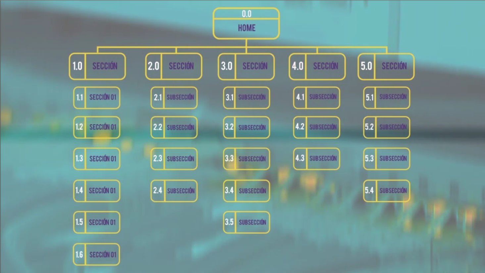</div>

También permite tener un marco de referencia y control de trabajo.

Es intuitivo para que la persona pueda encontrar lo que busca y explorar el sitio aprendiendo sobre lo que ofreces con total facilidad.

Si el sitio no cumple con lo anterior es muy probable que el usuario se vaya y no permanezca mucho tiempo.

La presentación del mapa del sitio se puede hacer mediante una barra de navegación, algunos a su vez utilizan los **Breadcrums** para ubicar al visitante dentro de la estructura del mapa del sitio en la que se encuentran.

### Qué incluir en nuestro sitio

* Logo del sitio
* El click en el logo debe redirigir a la página principal
* Los nombres de las secciones deben ser implicitos y en el lenguaje del visitante
* Mostrar pocas secciones para no marear al visitante
* Preferir nombres cortos.
* Contrastar con un color la sección en donde se ubica el usuario
* Si se incluye un `login` o un `logout` ubicarlo claramente en la barra de navegación

Ejemplo, en la barra de navegación de bootstrap podemos notar todo el mapa de navegación a la izquierda y a la derecha el conjunto de acciones en el sistema. Un usuario nuevo puede comprender rápidamente que le ofrece el sistema unicamente viendo la barra de navegación.

A continuación veremos un tipico Breadcrum, que nos despliega prácticamente toda la ruta y nos permite ir interactuando con las secciones que nos interesan:

<div align="center">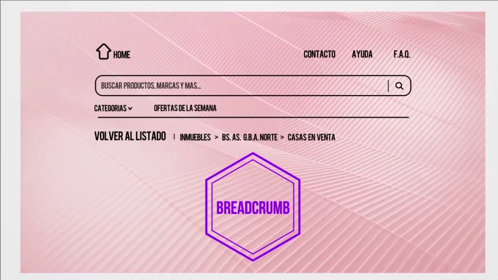</div>

Permite desplazarnos de forma jerarquica. Sólo es recomendable usarlo para sistemas en los que tenemos más de 2 secciones, es decir, tenemos subcategorias dentro de las categorias.

Los **BreadCrumbs** tienen 3 tipos de uso:

* Basados en la jerarquía o ubicación: Similar al ejemplo que se presentó anteriormente.

* Basado en atributos: Se pasa de lo más abstrato a lo más particular de un producto o tema.
Por ejemplo: Libros > Computación > Lenguajes de programación > El lenguaje de programación Java...

* Basados en pasos de un proceso: Se indica los pasos que realizó el usuario hasta llegar al punto donde está parado.
Por ejemplo: Elige tu producto > Confirma tus datos de pago > Indica domicilio de entrega

| Elemento | Función |
| --- | --- |
| `nav bar` | Permite crear una barra de navegación. Normalmente muestra todas las opciones que tiene el visitante para ver más acerca del sitio. Normalmente se mantiene exactamente igual en todas las páginas del sitio y da enfoque en donde está parado el usuario(por ejemplo subrayando la ruta donde se ubica). En celulares suele colapsarse para no entorpecer el diseño de la web |
| `BreadCrum` | Permite navegar mediante jerarquias en el sitio, indicando cada paso que tomó el usuario |

## Implementando Navbar y BreadCrums

El siguiente elemento hace referencia a un botón tipo hamburguesa que normalmente vemos en celulares cuando la barra del navegador se colapsa.

```
<button class="navbar-toggler" type="button" data-toggle="collapse">
    <span class="navbar-toggler-icon"> </span>
</button>
```

Listado de elementos importantes:

| Elemento | Función |
| --- | --- |
| `<nav>` | Define un componente Nav |
| `<ul>` | Lista desordenada |
| `<li>` | Elemento de una lista |
| `navbar-dark` | Indicará que el navbar tendrá un estilo obscuro y con ello letras blancas |
| `bg-dark` | Indica que el fondo será obscuro |
| `navbar-brand` | Define el primer elemento a la izquierda de todo el navegador |
| `navbar-toggler` | Indica que el siguiente elemento será el que se muestre cuando se colapse el menú |
| `navbar-toggler-icon` | Es un icono de hamburguesa ideal para desplegar en celulares o pantallas pequeñas |
| `data-toggle="collapse"` | Indica la acción de colapso | 
| `data-target="#navbarSupportedContent"` | Indica el contenido que desplegará, esto está en función de un id que se declara abajo |
| `navbar-expand-md` | Indica que se muestren los elementos de la barra cuando el tamaño sea medium, si es menor, entonces se mostrará colapsado el menú | 
| `fixed-top` | Indica que quede fijo en la parte superior |
| `collapse` | Indica que el elemento está relacionado a un colapso |
| `navbar-collapse` | Indica que será un elemento colapsable |
| `mr-auto` | Indica que se tendrá un margen a la derecha automático |
| `nav-item` | Indica que se trata de un item de la lista |
| `active` | Indica que item se encuentra activo |
| `nav-link` | Para que el elemento no se vea como en los hipervinculos azules y subrayados |


## Copiando un elemento mediante consola

Para copiar un elemento sólo es necesario ejecutar el siguiente comando en la consola `cp nombreArchivo nombreArchivoCopia`

El ejemplo para nuestro proyecto puede ser:

```
cp index.html about.html
```

Generará una copia del index.html pero con el nombre about.html. Queda a la perfección para nuestro proyecto porque permite duplicar rapidamente una página.

Para ello quitamos todo lo que está ubicado en el div del contenedor y lo reemplazamos por un Span con texto [lorem](www.lipsum.com) ó mediante el atajo de VSC `lorem:300` o la cantidad que quieras de palabras.

No hay que olvidar poner en el navbar cuando estamos posicionados en ese lugar mediante la clase `active`

## Breadcrumbs

Para declararlos es sencillo, sólo es necesario poner atributos como los siguientes:

```
<nav aria-label="breadcrumb">
    <ol class="breadcrumb">
        <li class="breadcrumb-item active" aria-current="page">Home</li>
    </ol>
</nav>
```

Y para la página de about debería ir algo como lo siguiente:

```
<nav aria-label="breadcrumb">
    <ol class="breadcrumb">
        <li class="breadcrumb-item" aria-current="page"><a href="./index.html">Home</a></li>
        <li class="breadcrumb-item active" aria-current="page">Nosotros</li>
    </ol>
</nav>
```

| Elemento | Función |
| --- | --- |
| `<ol>` | Define una lista ordenada |
| `aria-label="breadcrumb"` | Define que se tratará de un Breadcrumb |
| `breadcrumb-item` | Define que se trata de un item de tipo breadcrumb |

Finalmente, al termino de estos pasos se tendrá lo siguiente:

* Index:

<div align="center">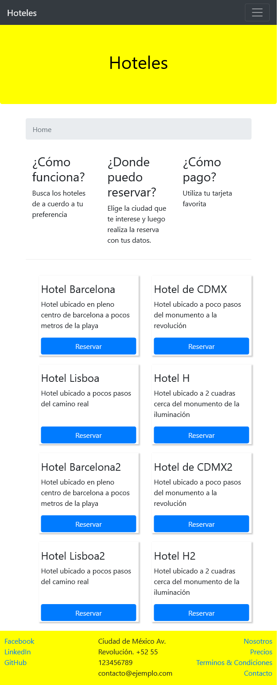</div>

* About:

<div align="center">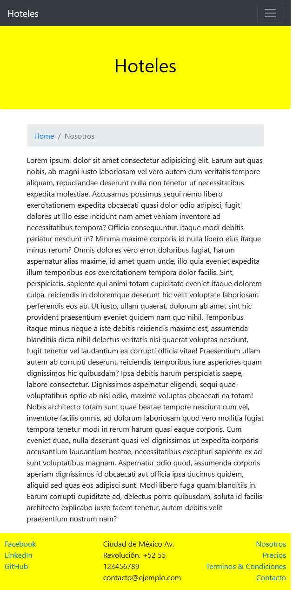</div>


## Iconos de Bootstrap

Manejo de iconos como fuentes: La ventaja de manejarlos como fuentes es que tenemos la posibilidad de manipular el color, el tamaño y demás como si fuera un texto dentro de un parrafo.

Para ello instalaremos mediante `npm install open-iconic --save`

Para agregar un icono simplemente hay que seleccionar el `span` de cada icono y colocarlo en donde queramos. Ejemplo:

```
<address>
    <h3>Dirección</h3>
    <p><span class="oi oi-home footer-address-icon"></span>Ciudad de México Av. Revolución.</p>
    <p><span class="oi oi-phone footer-address-icon"></span>+52 55 123456789</p>
    <p><span class="oi oi-inbox footer-address-icon"></span>contacto@ejemplo.com</p>
</address>
```

El producto final se veria algo como lo siguiente:

<div align="center">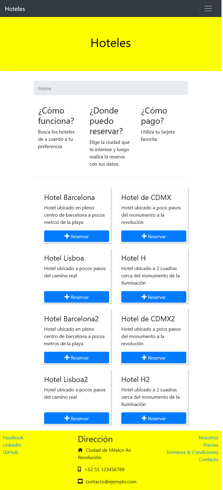</div>

## Formularios

Lo primero que haremos es crear una copia de about pero ahora llamado contacto, recordando que el comando a ejecutar seria el siguiente: `cp about.html contact.html`.

| Elemento | Función |
| --- | --- |
| `<form>` | Define un formulario |
| `form-row` | Da estilos a la columna para que se vea agradable con el formulario |
| `form-group` | Indica que los elementos contenido formarán parte de un grupo del formulario |
| `<label>` | Es una etiqueta, normalmente siempre lleva el atributo `for=""` y dentro de las comillas va el nombre del input al que irá relacionado |
| `<input>` | Será un espacio en donde el usuario podrá ingresar datos. Siempre llevará el atributo `type` que hace referencia al tipo de entrada, `name` que es con el que se relaciona con su label y un `id` |
| `placeholder=""` | Es el contenido que llevará la casilla del input, sin embargo sólo aparece al fondo y no afecta cuando escribe el usuario. Normalmente se usa como guia para que el usuario sepa que ingresar en esa casilla |
| `form-control` | Es importante tenerlo para poder respetar el formato y estilos del formulario, si no se incluye, se nota algo extraño |
| `<select>` | Como su nombre lo dice, nos permite seleccionar entre una serie de opciones |
| `<option>` | Como su nombre lo dice, es una opción seleccionable del grupo |
| `<textarea>` | Es una area en la que el usuario podrá digitar su mensaje |

<div align="center">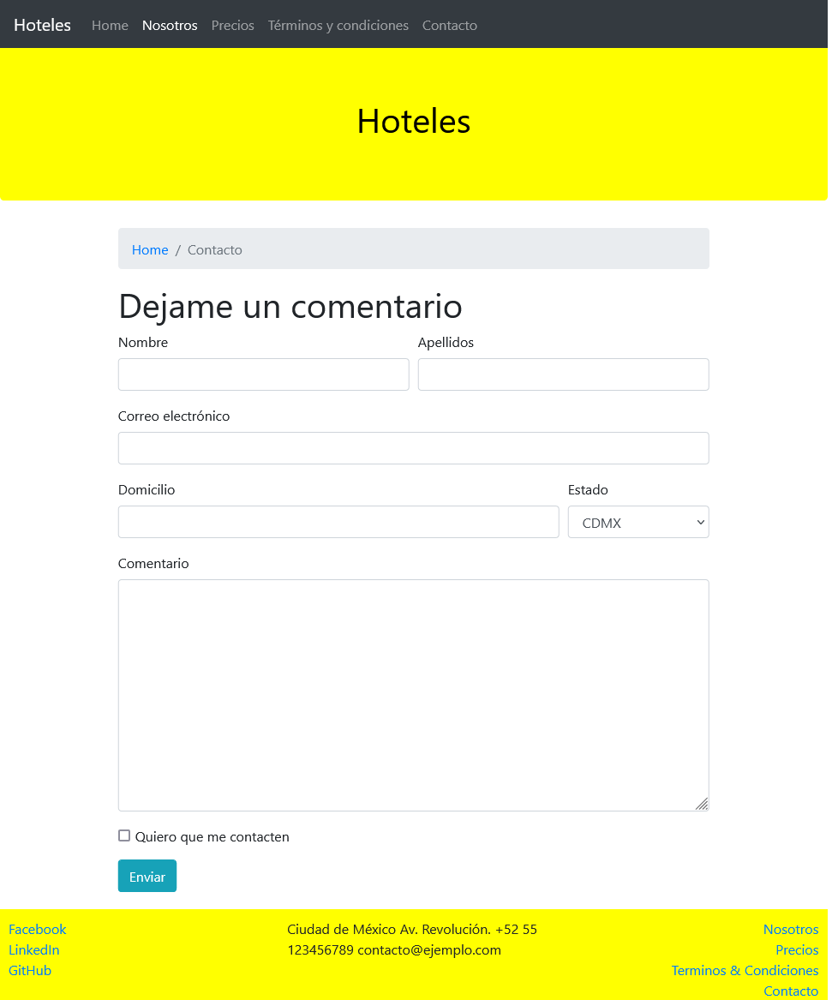</div>

## Mostrar contenidos en Tablas

Para ello podemos hacer una copia de about y la llamamos prices. `cp about.html prices.html` 

| Elemento | Función |
| --- | --- |
| `<table>` | Define una tabla |
| `<thead>` | Define el encabezado de una tabla |
| `<th>` | Son elementos que conformarán el encabezado |
| `<tbody>` | Define el cuerpo de una tabla |
| `<tr>` | Indica que se trata de una fila |
| `<td>` | Indica que se trata de una columna |
| `thead-dark` | Le da un estilo obscuro al encabezado |
| `table-striped` | Hace una alternancia de color, uno blanco y otro un poco gris, es muy agradable a la vista |
| `table-responsive` | Permite que la tabla sea responsive |

Para hacer responsive una tabla sólo es necesario colocarla dentro de una etiqueta `div` la cual contenga la clase `table-responsive`, con ello lograremos que sea totalmente responsiva. Notaremos que por más elementos que tengamos siempre se mantendrá en el contenedor.

## Uso de Cards en BootStrap 

Un card lo podemos identificar por 3 partes, un header, un body y un footer.

| Elemento | Función |
| --- | --- |
| `card` | Le añade un borde |
| `card-body` | Le indica que se trata de un body |
| `card-title` | Como su nombre lo dice, está totalmente especializada para manejar titulos. Esto aplica margenes y paddings de forma automática |
| `text-muted` | Coloca el color en un tono gris, sin tanto peso. |
| `card-text` | Lo unico que hace es indicar que se trata de un texto |

## Uso de imagenes en BootStrap

| Elemento | Función |
| --- | --- |
| `img-fluid` | Es una clase para poder hacer responsive una imagen, en el caso del proyecto adapta la imagen al tamaño del contenedor. Si no colocaramos esta clase notariamos que el tamaño se desfasaría al cambiar el tamaño de la imagen |
| `card-img-top` | Coloca la imagen en la parte superior |

## Al final de este modulo 2

El resultado debe verse como el siguiente:

* Index
<div align="center">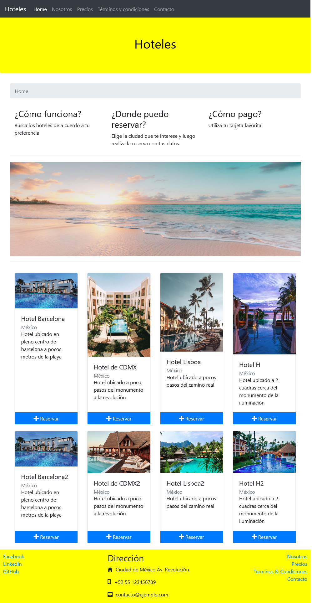</div>

* Nosotros

<div align="center">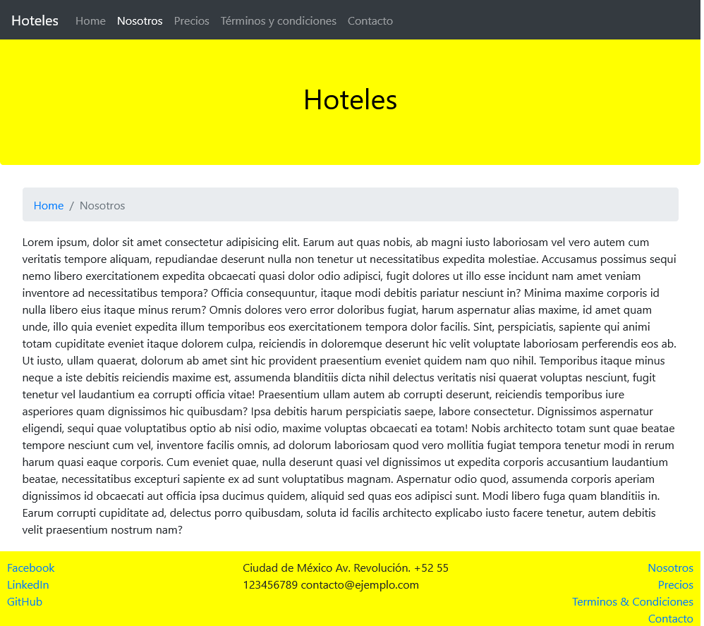</div>

* Precios

<div align="center">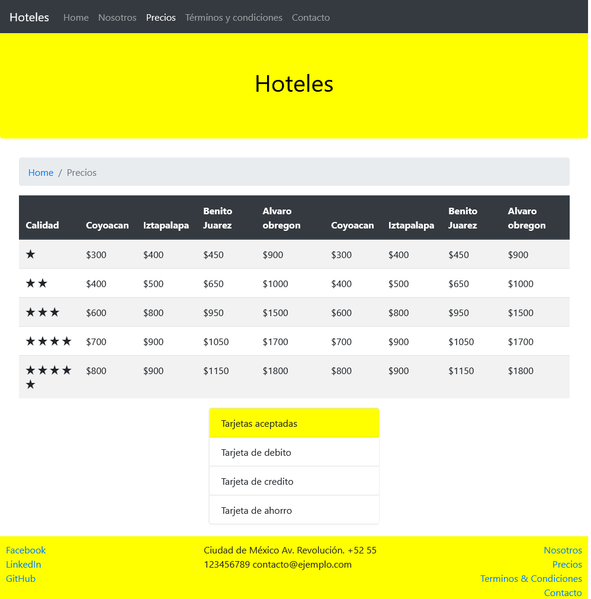</div>

* Contacto

<div align="center">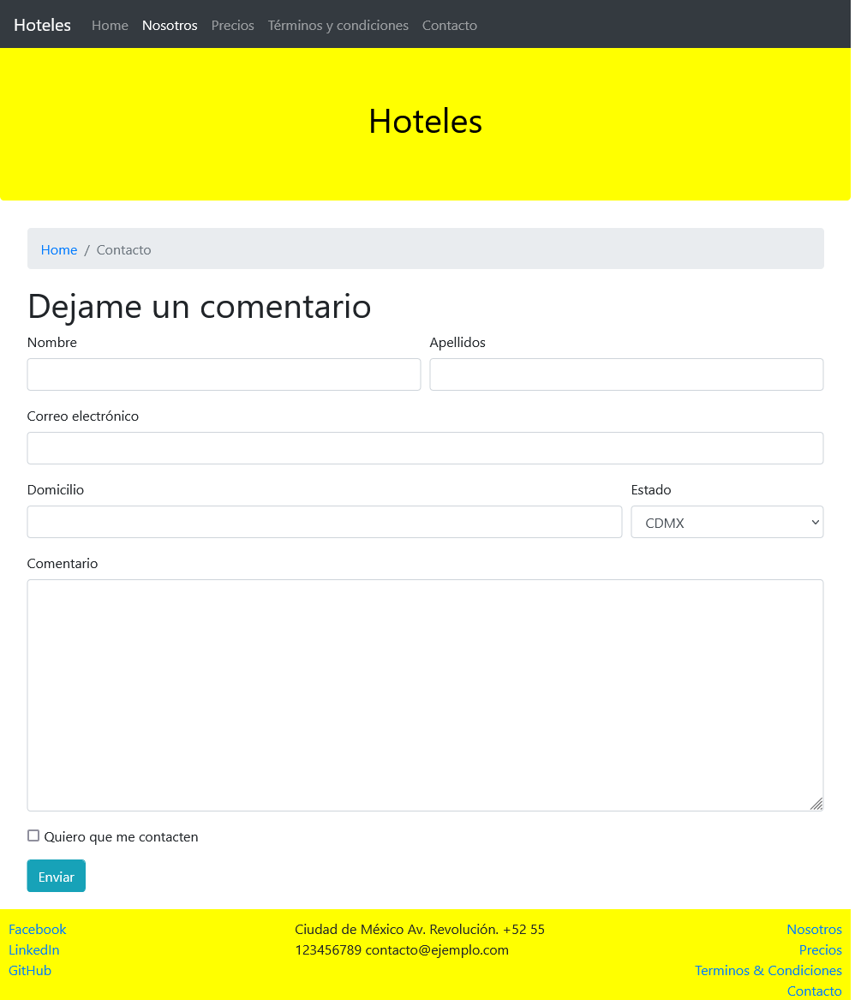</div>

## Badges

> Los badges tienen como finalidad brindar información de contexto o 
complementaria. Básicamente, agregan texto con un formato especial a un elemento o bien agregan un número también con formato especial. Algunas situaciones comunes de uso son resaltar secciones nuevas, nuevos elementos, nuevos productos o ítems, algunos ubican fechas en el badges para resaltar la temporalidad del elemento. También podemos utilizar badges sin necesidad de que estén contenidos por algún otro elemento.  Aquí tenemos 2 alternativas para hacerlo: de la misma forma que mostramos antes o bien,  utilizando la clase badge-pill. Los badge-pills o pills tienen los bordes redondeados. Su uso técnico es similar a todos los badges. Son prácticos para indicar etiquetas, tags, o textos que no necesitamos que estén asociados a otras palabras sino que tienen peso por sí mismos.Otro uso que podemos hacer con los badges es indicar un valor numérico que acompañe a un texto,  similar a lo que hacen algunos gestores de correo electrónico con la cantidad de mensajes sin leer o  algunos sitios con las notificaciones pendientes. complementaria. Básicamente, agregan texto con un formato especial a un elemento o bien agregan un número también con formato especial. Algunas situaciones comunes de uso son resaltar secciones nuevas, nuevos elementos, nuevos productos o ítems, algunos ubican fechas en el badges para resaltar la temporalidad del elemento. También podemos utilizar badges sin necesidad de que estén contenidos por algún otro elemento.  Aquí tenemos 2 alternativas para hacerlo: de la misma forma que mostramos antes o bien,  utilizando la clase badge-pill. Los badge-pills o pills tienen los bordes redondeados. Su uso técnico es similar a todos los badges. Son prácticos para indicar etiquetas, tags, o textos que no necesitamos que estén asociados a otras palabras sino que tienen peso por sí mismos.Otro uso que podemos hacer con los badges es indicar un valor numérico que acompañe a un texto,  similar a lo que hacen algunos gestores de correo electrónico con la cantidad de mensajes sin leer o  algunos sitios con las notificaciones pendientes.

## Alertas

> Las alertas (alerts) las utilizaremos para notificar inmediatamente el resultado de una acción al  usuario. Por ejemplo, en caso de concretar una compra, mostraremos una alerta indicado el éxito de  la operación, o en caso de fallar, indicaremos con un fondo rojo el motivo de error. Siempre que el  usuario realice una acción, debemos notificar inmediatamente el resultado de la misma. En esas  situaciones, las alertas son muy útiles y por lo general utilizaremos este componente que nos brinda Bootstrap.Estas notificaciones se suelen utilizar debajo del header, o barra de navegación si el sitio posee. Deben visualizarse fácilmente. Para mostrar una alerta u ocultarla, tenemos a disposición las librerías de Javascript que incluye Bootstrap. Desde la programación, podremos mostrar u ocultar las alertas como queramos con algunas animaciones que suavizan la transición. Veremos su uso en la sección de javascript.  

## Barras de progreso

> Las barras de progreso, o progress bars, indican el avance de una operación en tiempo real. Veremos el componente que nos ofrece Bootstrap y las varias que tenemos para su uso. De todas formas, en la sección de Javascript profundizaremos sobre su uso ya que debemos utilizar un script JS para mantener actualizado el avance de la barra de acuerdo al progreso de la acción. Para que se entienda mejor, debemos monitorear la operación observando el grado de avance y con ese dato, actualizar la barra de progreso de forma acorde.  Básicamente, están formadas por dos componentes: una que indica el contexto de la barra y otro dentro de este que ocupa el rol de la barra en sí.Tenemos un contenedor con el elemento div y la clase progress. Dentro de este, tenemos otro div con la clase progress-bar. El elemento interior tiene varios atributos, pero el más importante es el valor del width donde indicamos el nivel de progreso lo que debe ocupar el azul de la barra.  Si incluimos un texto antes del cierre del div de la barra, ese texto se mostrará por defecto en color blanco y centrado en el ancho del progreso de la barra.


## Trabajando con Tabs y Pills

Podemos pensar que primero se definen las pestañas y por otor lado en donde se define todo el contenido o elementos a desplegar

| Elemento | Función |
| --- | --- |
| `nav-tabs` | Define que se tratará de tabs o pestañas |
| `id="myTab"` | Sólo le asigna el nombre de su identificador |
| `role="tablist"` | Le indica que se tratará de de una lista de pestañas |
| `nav-link` | Hace referencia a que este elemento estára enlazado a otro |
| `id="compara-tab"` | Es de buena práctica, el poner en el nombre a que tipo de elemento está viculado, así podremos darnos cuenta que este elemento está referenciado a una pestaña por el `tab` |
| `data-toggle="tab"` | Atributo de data en donde le especificamos que cumpla con el rol de tab. Con esto Bootstrap ya incluye el contenido de JS para que funcionen las pestañas. Lo que hace es vincular estas pestañas con el panel o el contenido |
| `href="#compara"` | Importante poner el ID del panel con el que vamos a referenciar y que sea ese el contenido a desplegar. |
| `tab-content` | Le indicamos que será un contenedor para una pestaña. Dentro del div que contenga esta clase pondremos un div por cada uno de los contenidos |
| `tab-pane` | indica que será un panel |
| `fade show` | Definen una pequeña animación de transición de pestañas |
| `active` | Indica en donde está posicionado y además el valor por defecto |
| `id="nombre"` | Debe ser el mismo id al que le estamos indicando en los `nav-link` es muy importante que coincidan para que esto funcione correctamente. |
| `role="tabpanel"` | Como su nombre lo dice, indica que se trata de un panel de pestañas |
| `aria-labelledby="compara-tab"` | Aquí debe ir el mismo nombre que le indicamos en el id del `nav-item` importante para que funcione |

## Uso de Pills

El uso de pildoras nos permite hacer un comportamiento semejante al anterior de los tabs. Lo unico que hay que hacer es reemplazar ~~nav-tab~~ por un `nav-pills` y en `data-toggle` decirle que son pills `data-toggle="pill"`. La unica diferencia es el estilo que hay entre el diseño de las pestañas, a continuación verás el ejemplo de cual es la diferencia entre estos:

* Tabs

<div align="center">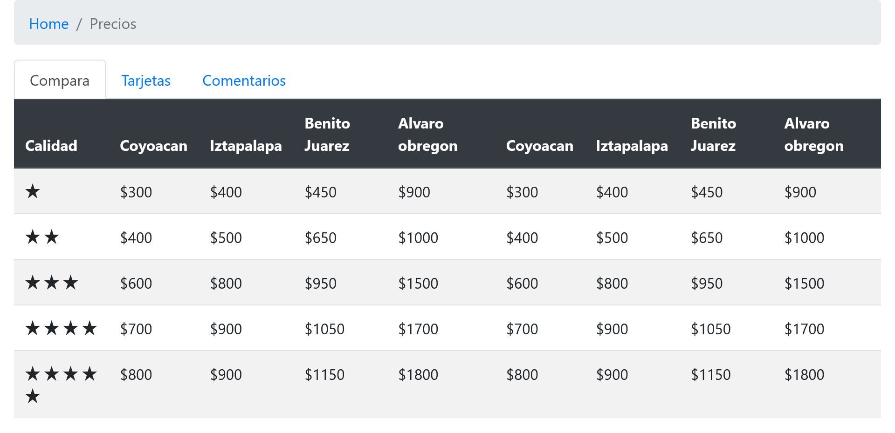</div>

* Pills

<div align="center">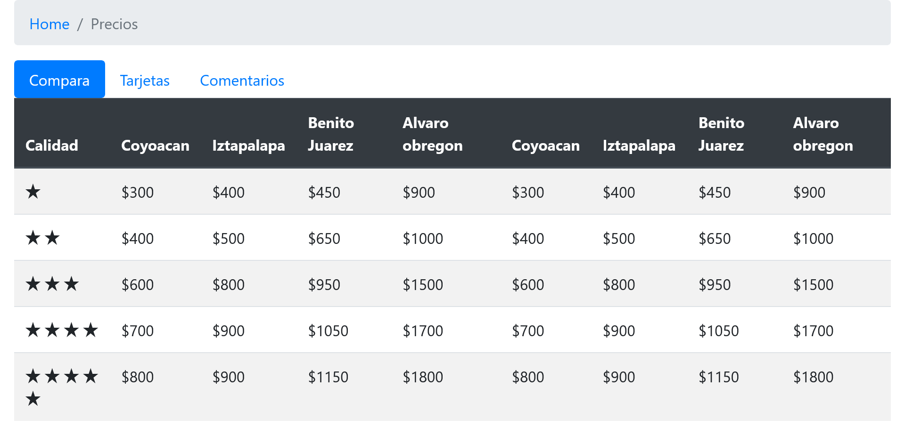</div>

## Trabajando con Collapse

Collapse como su nombre lo dice permite colapsar contenido, es decir, permite mostrar u ocultar según lo que necesites en tu desarrollo, el ejemplo que se aborda en este curso será presionar un botón para que nos despliegue contenido más detallado, por ejemplo una descripción de algun servicio o demás.

Para poder manejar con este tipo de elementos lo primero que hay que hacer es definir botones que sean de tipo **collapse**, posteriormente a cada uno de los elementos que vamos a desplegar deberemos agregarle las clases `collapse multi-colapse` para poder hacer uso de ese elemento y ponerle un **id** para poder manejarlo.

El `multiColapse` nos permite manipular diferentes valores al mismo tiempo y puedan acomodarse en función de lo que se presiona.

Asegurate de colocar diferente valor de aria-controlls ya que este valor sirve para distinguir entre los distintos componente.
Recordemos que en el `data-target` va el id del elemento que queremos desplegar.

## Usando Accordion

| Elemento | Función |
| --- | --- |
| `accordion` | Define que se tratará de un acordión |
| `collapse show` | Indica que el contenido ya se encuentre desplegado, permite mostrar contenido desde un inicio. |

<div align="center">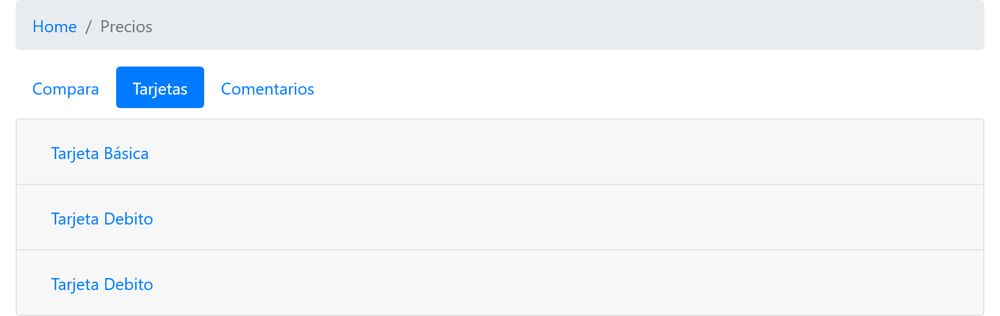</div>

## Uso de Modal

Permite desplegar información de completo interés, le da un peso muy importante a la información dado que capta completamene la información del usuario, el modal puede declararse en cualquier sitio del HTML, sin embargo, se aconseja colocarlo hasta el final para evitar confusiones o errores.

Su codigo de uso fue el siguiente:

```
<div class="modal fade" id="contacto" tabindex="-1" role="dialog" aria-labelledby="exampleModalLabel" aria-hidden="true">
    <div class="modal-dialog" role="document">
        <div class="modal-content">
            <div class="modal-header">
                <h5 class="modal-title" id="exampleModalLabel">Contacto con el hotel</h5>
                <button type="button" class="close" data-dismiss="modal" aria-label="Close">
                    <span aria-hidden="true">&times;</span>
                </button>
            </div>

            <div class="modal-body">
                <form action="">
                    <div class="form-group">
                        <label for="recipient-name" class="col-form-label">Tu email: </label>
                        <input type="text" name="recipient-name" class="form-control" id="recipient-name">
                    </div>
                    <div class="form-group">
                        <label for="message-text" class="col-form-label">Mensaje</label>
                        <textarea class="form-control" name="message-text" id="message-text" cols="30" rows="10"></textarea>
                    </div>
                </form>
            </div>
            <div class="modal-footer">
                <button type="button" class="btn btn-success">Enviar</button>
            </div>
        </div>
    </div>
</div>
```

Si se presta atención se ve que existe un div principal que tiene la clase `modal fade` que define la animación.

En este caso primero declaramos el modal y despues de ello lo accionamos mediante un botón.

Para activarlo es necesario poner en un botón el atributo `data-toggle="modal"` y el uso de `data-target="#contacto"` para saber que contenido estará accionando.

Es importante saber que dentro del modal es posible incluir ualquier código HTML con diversas funciones o declaraciones.

| Elemento | Función |
| --- | --- |
| `modal fade` | Define el tipo de animación que usará para desplegar el elemento, en este caso es una aparición suave. Es muy importante usar la clase modal dado que estamos hablando de ello |
| `modal-dialog` | Define el tamaño del dialogo en una ventana |
| `modal-content` | Establece estilos y margenes para que el contenido se vea de la mejor manera |
| `modal-header` | Como su nombre lo dice, se trata del encabezado |
| `modal-body` | Como su nombre lo dice, es el apartado en el que se define el cuerpo del modal |
| `data-toggle="modal"` | Indica que se trata de un atributo para el manejo de un modal |
| `data-target="#contacto"` | Que hará referencia al id del contenido modal |

## Tooltips

El siguiente atributo `data-placement="top"` indica la posición que tendrá en el elemento. Y le definimos un titulo mediante `title="Las primeras reservas cuentan con spa doble durante la instancia sin costo adicional!"`
Sin embargo estas acciones aún no son suficientes para activar el tooltip, para ello debemos declarar un script, porque por default no se activa, para ello crearemos un script como el siguiente:

```
<script>
    $(function(){
        $("[data-toggle='tooltip']").tooltip();
    })
</script>
```

Al hacer esto ya tendremos el tooltip activado para que cuando el usuario ponga el cursor encima del titulo lo muestre. 
Lo que hace el script es buscar todos los elementos que tengan la propiedad `data-toggle='tooltip'` con el valor de tooltip y permite activar esa ayuda.
Son muy utiles para presentarle al usuario información relevante como ayuda, orientación o demás que creamos importante. Normalmente son encontrados en formularios para auxiliar al usuario sobre que datos debe ingresar o como es que se espera el formato, tiene usos muy versatiles.

## Usando Popovers

Para ello igual necesitamos de un script para activarlos por lo que podemos incluirlo dentro del mismo scrip pasado sólo que ahora le añadimos una instrucción extra:

```
<script>
    $(function(){
        $("[data-toggle='tooltip']").tooltip();
        $("[data-toggle='popover']").popover();
    })
</script>
```

Una cosa muy importante a considerar es que un popover generalmente se activa al hacer **click** o mediante el evento mouseover que detecta cuando el mouse se posiciona en ese sitio.
En este caso será implementado en el botón de reservar.

## Carousel

Carrucel implementado con BootStrap, es un elemento muy util para estar mostrando productos destacados y demás, al tener una animación llama la atención, el sitio estrella para usar este componente es para destacar articulos de gran relevancia. Tiene distintos estilos, los más claros es cuando le incluimos botones para poder estár cambiando entre un elemento y otro.

Para implementar este elemento es necesario declararle un identificador para cuando definamos controles. Estos controles siempre van a aplicar sobre un componente.

Tambien es necesario agregarle las clases `carousel slide` para indicarle que será un carrucel. También necesitamos ponerle un `data-ride="carousel"` para hacerle saber al elemento que estará deslizando el contenido.

Posteriormente todos los items deberán estar contenidos en un elemento div que tenga la clase `carousel-inner`, posteriormente cada elemento deberá tener la clase `carousel-item` haciendo alusión a que se trata de un elemento del carrucel, además siempre debe haber sólo 1 que contenga la clase `active`, si no la incluimos entonces el carrucel no funcionará. Si agregamos imagenes, lo que podemos hacer es incluir las clases `d-block w-100` para que el navegador no autoajuste las imagenes a su tamaño.

* Agregando botones:

Sólo es necesario definir las siguientes lineas de código:

```
<a class="carousel-item-prev" href="#carouselControl" role="button" data-slide="prev">
    <span class="carousel-item-prev-icon" aria-hidden="true"></span>
    <span class="sr-only">Anterior</span>
</a>
<a class="carousel-item-next" href="#carouselControl" role="button" data-slide="next">
    <span class="carousel-item-next-icon" aria-hidden="true"></span>
    <span class="sr-only">Siguiente</span>
</a>
```

Hay que tener en cuenta que este tipo de clases pueden cambiar entre una versión y otra. En el curso se implementaban esas clases, sin embargo, en bootstrap 4.6 cambiaron un poco a lo siguiente:

```
<a class="carousel-control-prev" href="#carouselControls" role="button" data-slide="prev">
    <span class="carousel-control-prev-icon" aria-hidden="true"></span>
    <span class="sr-only">Anterior</span>
</a>
<a class="carousel-control-next" href="#carouselControls" role="button" data-slide="next">
    <span class="carousel-control-next-icon" aria-hidden="true"></span>
    <span class="sr-only">Siguiente</span>
</a>
```

Por ultimo veremos como **modificar el intervalo** que existe entre una transición y otra mediante un script el cual es el siguiente, en donde se especifica el tiempo en el que cambia de un Slide a otro:

```
$('.carousel').carousel({
    interval:2000
})
```

## Fin modulo 3

Para el final del modulo 3, el proyecto deberá tener una apariencia semejante a lo siguiente:

* Index:

<div align="center">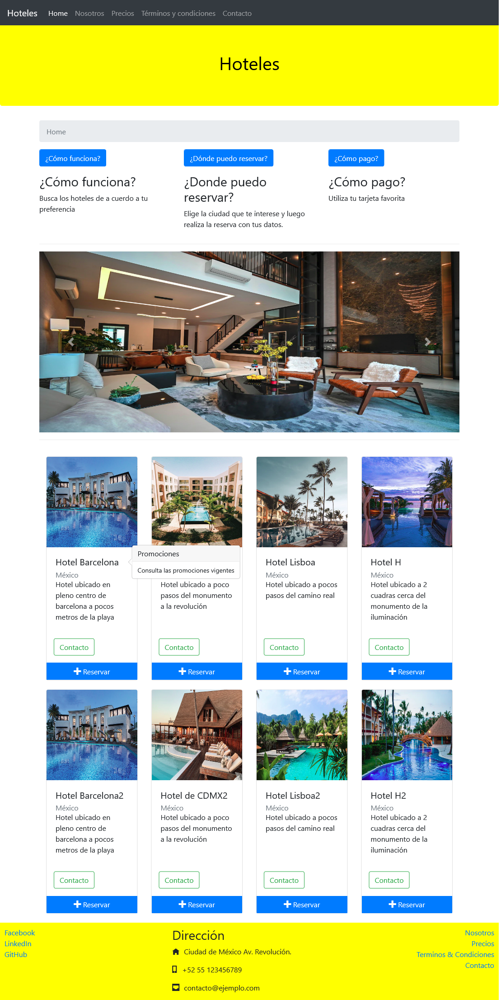</div>

* Prices:

<div align="center">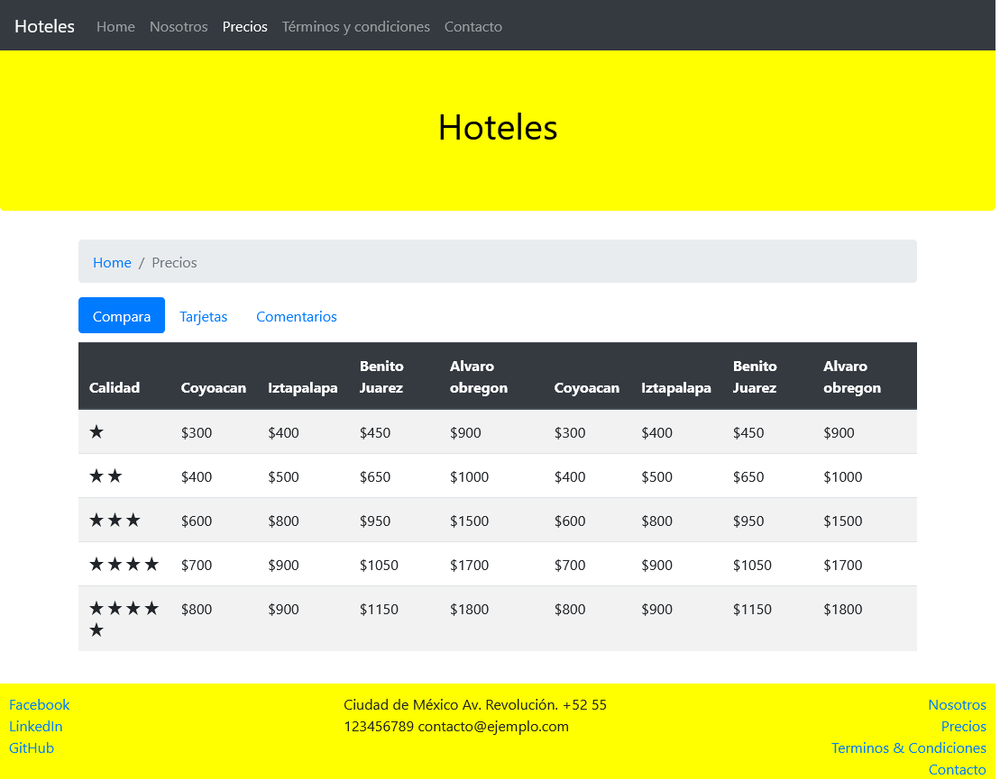</div>

<div align="center">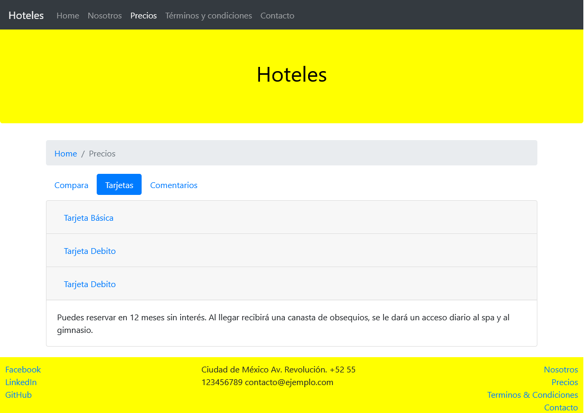</div>

## Modulo 4

>Jquery es una librería Javascript muy liviana que tiene como misión simplicar el uso de JavaScript, particularmente, en la gestión del DOM y las llamadas AJAX.Podemos pensarlas como las interacciones asíncronas con el servidor. El DOM, domain object model, es el conjunto estándar de objetos que nos permiten representar documentos HTML, XML y XHTML

<div align="center">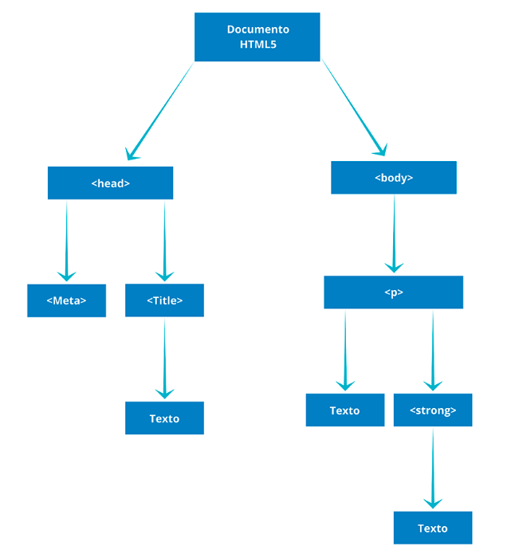</div>

>Cuando decimos que nos permite gestionar el DOM, hablamos de agregar componentes html, 
acciones sobre los componentes, como pueden ser los clicks o doble clicks, suscribirnos a eventos o  directamente manipular cualquier componente cambiando sus clases, estilos, contenido, etc. De  esta forma, podemos dotar de dinamismo nuestra página. Pensemos en un div al cual podremos  agregarle fotos o imágenes de acuerdo al resultado de una consulta que haga el usuario.  

>Jquery es una librería de Javascript y escrito en este lenguaje. Lo que nos aporta es una capa de abstracción para que  lidiemos con estas tareas en un nivel más alto y hablemos de estas tareas en nivel más cercano a  nuestro lenguaje. A esto llamamos simplificación. En vez de explicar con muchas operaciones el  hecho de cambiar una clase para un botón, directamente usamos los métodos de JQuery para  hacerlo que resultan en algo más intuitivo para el programador. Podemos pensar en nivel base que sería JavaScript y por encima de este, Jquery.  

> Sintaxis Jquery 
>La estructura de toda instrucción Jquery está definida por el signo `$`, seguida por un selector HTML y luego por una acción. Veamos un ejemplo: `$(“#btn_upload”).hide();`
 
>El signo $ referencia a Jquery y lo define. Entre paréntesis indicamos el selector o query, que tiene por consecuencia seleccionar todos los elementos del DOM que aplicar al criterio del selector. Por último, la acción, que en este caso es el método hide() y aplica siempre a todos los elementos seleccionados. 

<div align="center">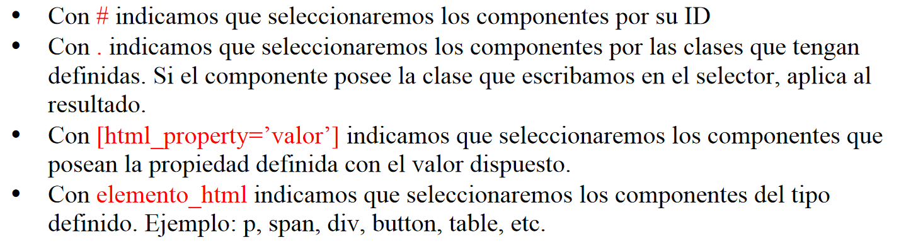</div>

<div align="center">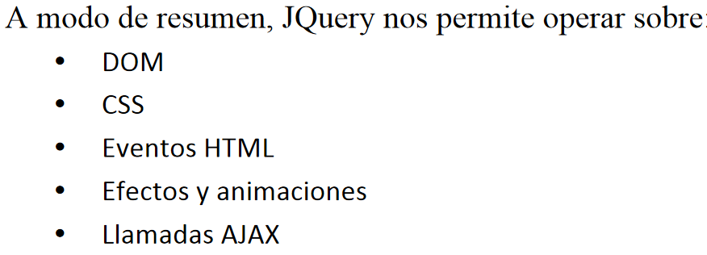</div>

<div align="center">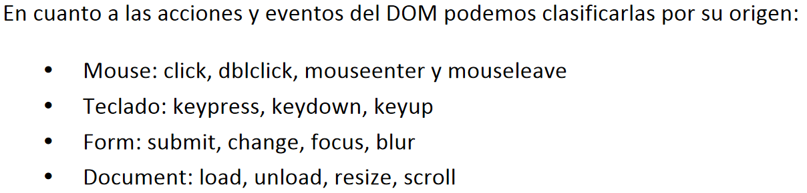</div>

## Conceptos Básicos de JQuery

Las opciones de una elemento las solemos definir en un formato JSON, por ejemplo: `$('#myModal').modal(options)`

Muchos de los elementos de BootStrap ya contienen métodos para realizar acciones en especifico. Por ejemplo `$('#myModal').modal(toggle)` recordemos que el toggle lo que nos dice es que si está mostrado que se oculte y se está oculto que se muestre.

Y también tienen eventos que suelen ser mensajes que se disparan automaticamente, en el caso de método nosotros mediante un script le indicaremos que hacer y en el evento es algo que siempre pasará y podemos modificarlo a nuestro gusto.

## Uso de eventos

En este caso se elegirá un modal para ver un poco más clara la funcionalidad de un evento. Para ello le declararemos un id contacto al botón del modal. Y mandar a llamar el evento, en este caso usaremos el siguiente `show.bs.modal` que se ejecuta de inmediato cuando el modal el abierto o desplegado, este evento es ideal para autocompletar campos de un formulario o algo semejante.
**Nota:** El **ON** siempre lo vamos a usar dentro de JQuery para suscribir eventos **siempre** 
BootStrap maneja conceptos de verbos en ingles en la declaración de estos métodos, por ejemplo usa los infinitivo cuando los verbos se inician o están en desarrollo y el participio cuando acaban de terminar por ejemplo:

`show.bs.modal` cuando el modal acaba de abrirse y el `shown.bs.modal` cuando el modal recién acaba de cerrarse.

El script se vería de la siguiente manera:
```
$(function(){
    $("[data-toggle='tooltip']").tooltip();
    $("[data-toggle='popover']").popover();
    $('.carousel').carousel({
        interval:2000
    });

    /* Eventos */
    $("#contacto").on("show.bs.modal", function(e){
        console.log("El modal se está mostrando");
    });
    $("#contacto").on("shown.bs.modal", function(e){
        console.log("El modal se mostró");
    });
    $("#contacto").on("hiden.bs.modal", function(e){
        console.log("El modal se oculta");
    });
    $("#contacto").on("hidden.bs.modal", function(e){
        console.log("El modal se ocultó");
    })
})
```

Viendo un uso práctico de estos eventos, lo que se hará es cambiar de color el botón. Por ejemplo, esto nos sirve para guiar al usuario a saber si ese hotel ya lo revisó y demás.
Si implementamos el cambiar de color cuando abra el modal podemos hacerlo de la siguiente manera en la que eliminamos la clase del color y le agregamos la que queremos.

```
$("#contacto").on("show.bs.modal", function(e){
    console.log("El modal se está mostrando");

    $("#contactoBtn").removeClass("btn-outline-success");
    $("#contactoBtn").addClass("btn-outline-danger");
});
```

Otra cosa que podemos hacer con el botón es desactivarlo mediante la instrucción `$("#contactoBtn").prop("disabled",true);` y cuando queramos activarlo puede ser con la instrucción `$("#contactoBtn").prop("disabled",false);`

## Precompiladores Saas y Less

Permite la actualización, la portabilidad y la capacidad de exportar hojas de estilos a otros proyectos. Permite reutilizar contenido CSS.

## Usando Sass

<div align="center"></div>

Para ello primero debemos instalar **Saas** con el comando `npm install sass --save` o la siguiente alternativa. Si bien en el proyecto no se ha usado mucho el uso de CSS, esto es suficiente para hacer uso de **Mixin** y **Variables**.

La otra alternativa para hacer la instalación y es la que se verá en este proyecto es con: `npm install node-sass --save-dev`, esto es una instalación de node-sass que nos permite instalar **Sass** en node, nos brindará una consola en la que podremos compilar el archivo y obtener un archivo `.CSS`. Para comprobar que se instaló correctamente podemos ir al archivo `package.json` y comprobar que en dependencias de desarrollo tenemos `node-sass:"version"`. Lo pusimos en Dev porque en cuando pasemos a un ambiente de producción no mandaremos los archivos Sass, sino los archivos .CSS, es por ello que no es necesario ponerlo dentro de las dependencias del proyectos que quedarán como realmente productivas.

Lo siguiente que vamos a hacer es incluir una tarea que nos va a servir para indicarle al compilador de Sass que genere el archivo CSS `"scss":"node-sass -o assets/css/ assets/css/"`, explicando paso a paso:

* `node-sass` es el nombre de la herramienta.
* `-o` de output.
* `css/` es la fuente donde va a buscar todo lo que sea **scss**.
* `css/` le dice que el output lo genere en la misma carpeta.

Lo siguiente a hacer es generar un archivo llamado `styles.scss` dentro de la carpeta en la que le indicamos en el JSON, en este caso es en la carpeta `assets/css/styles.scss`, dentro del archivo vamos a definir 2 variables de color.
Si queremos hacer busquedas de color para html podemos buscar en google `html color picker` y nos mostrará un gotero y un gradiente con todos los posibles colores.

La utilidad de usar esta herramienta es para poder emplearlo en más lugares de **CSS**, imaginemos el caso en el que colocamos un color en Hexadecimal en muchisimos elementos y llega el momento en el que la empresa necesita cambiar el color de la paleta de colores, pero ese código se encuentra en muchisimos elementos, será un proceso muy pesado, es por ello que mejor lo ponemos en una variable.

Sólo será necesario poner el código en la variable y poder emplearlo para más cosas.

Para poder ver el poder del ejemplo, es no modificar nuestro **main.css** sino que generaremos un css mediante el **styles.css** por lo que copiamos y pegamos el contenido del main en el styles y colocamos la variable en aquellos sitios donde iba el amarillo.

Y en el index en vez de referenciar al **main.css** lo que haremos es referenciar a **styles.css**, pero si nos damos cuenta, el archivo `styles.css` aún no existe, es por ello que ahora nos auxiliaremos de nuestra dependencia instalada.

Al ejecutar el comando `npm run scss` buscará el archivo **.scss** y lo generará a **.css**, lo ejecutamos y si lo abrimos veremos que todos aquellos lugares en donde usamos la variable ahora tienen el valor del código.

<div align="center">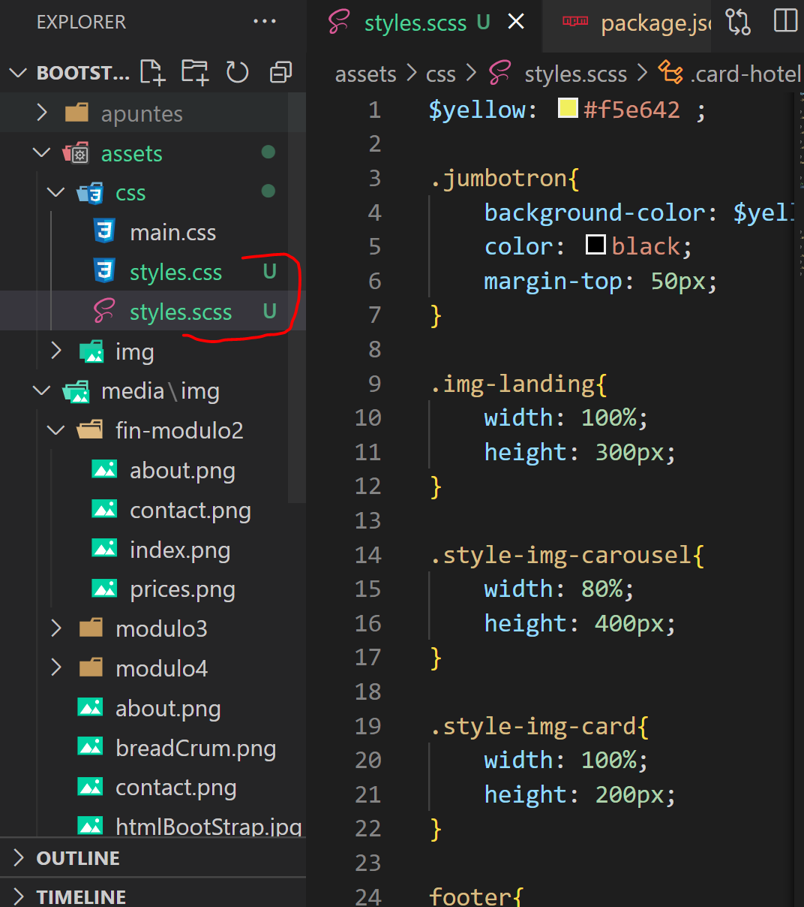</div>

No podemos usar el archivo **.scss** porque el navegador no puede interpretarlo, es por ello que necesitamos generar los **.css** que es un formato que si permite.

Básicamente nuestro compilador encuentra las variables que hemos definido y las reemplaza. Nos permite ahorrar muchisimo tiempo ante cambios de paletas de colores o demás.

| Elemento | Función |
| --- | --- |
| `Variables` | En Sass las variables se definen con el signo de `$` |

**Definiendo un Mixin:**

Los Mixin nos permite trabajar con los margenes y es muy sencillo, es como si se tratara de una pequeña función y se puede declarar de la siguiente manera.

```
@mixin margenes($top, $bottom){
    margin-top: $top;
    margin-bottom: $bottom;
}
```

y para ser usado unicamente se manda a llamar de la siguiente manera:

```
@include margenes(50px, 0px);
```

El usar Sass nos permite importar archivos, de esta manera podemos tener un orden extremadamente bueno, automatizar cosas y demás.

## Usando Less

<div align="center"></div>

Es una alternativa al uso de Saas, de igual manera se trata de un precompilado de CSS, para instalarlo es necesario instalar **Less** con el comando `npm install -g less`

| Elemento | Función |
| --- | --- |
| `Variables` | En Less las variables se definen con el signo de `@` |

Para compilar en Less es necesario poner el comando `lessc assets/css/styles2.less assets/css/styles2.css`

Para el uso de los Mixin en Less es de la siguiente manera:

```
.margenes(@top: 0px, @bottom: 0px){
    margin-top: @top;
    margin-bottom: @bottom;
}
```

Y pára mandarlo a llamar unicamente es necesario colocar un punto:

```
.margenes(50px, 10px);
```

# Puesta en producción

Por puesta en producción entendemos a la producción de algunas tareas mediante scripts de NPM que nos permitirán comprimir imagenes, pasas de SCSS a CSS, *comprimir* y *minificar* los archivos de HTML, son unicamente necesarias en un ambito productivo no en un ambito de desarrollo. Este tipo de tareas son aquellas que se requieren para la salida profesional.
A continuación veremos lo necesario para hacer nuestra **dist** o distribución para mandarlo al ambito que necesitamos.

## Herramientas mediante Scripts NPM

Para llevar acabo lo anterior hay que comenzar a instalar algunas herramientas que hacen falta e iremos agregando algunos scripts en el apartado correspondiente del *Package.json* para ir automatizando ciertas tareas.

Al final de todo, generaremos un **build** que va a concatenar una serie de tareas que iremos desarrollando en el proceso, para que cuando quitemos la tarea Build nos genere una carpeta respecto al proyecto, normalmente por convención se le pone el nombre **dist** la cual alude al termino de distribuición la cual contendrá todas las convenciones productivas del proyecto.

Instalando **onchange** y **rimraf** mediante el comando `npm install --save-dev onchange rimraf`.

* `onchange` lo que nos permite monitorear cambios en los archivos que le especifiquemos y en base a ello podemos especificarle alguna tarea que deseamos ejecutar cuando la ruta que le especifiquemos sea modificada, es muy útil, por ejemplo: Si se mofician los Sass o Less que nos corra el comando que genera los CSS de forma automática.

Una vez instalado el comando anterior acerca de `onchange` podemos generar nuestra primer tarea, y con ello automatizar el proceso. 
Colocamos lo siguiente `"watch:scss": "onchange assets/css/*.scss -- npm run scss"` en la parte de **scripts** del **package.json**, lo que hará esta tarea es ejecutar el comando `npm run scss` cuando detecte que un archivo scss cambie y nos genere de forma automática el CSS. En palabras breves busca todos los SCSS y los compilará.

Ahora, para automatizar ese proceso lo unico que debemos hacer es ejecutar el comando `npm run watch:scss` y podremos modificar los scss, cuando acabemos de modificar y guardar la tarea de compilación se hará de forma automática.

## Instalando y usando Save Concurrently

Esta herramienta nos va a permitir la ejecución de varias tareas al mismo tiempo de forma concurrente, además al momento del desarrollo podemos compilar automáticamente los archivos, tener el watch y ejecutar nuestro live-server al mismo tiempo. Esto nos ayuda a ahorrar tiempo sin tener que ejecutar, detener y ejecutar de nuevo.

Para instalar esta herramienta necesitamos colocar el siguiente comando `npm install --save concurrently`.

Cuando haya acabado de intalar la herramienta lo que se debe hacer es definir una tarea en el Package.json, lo que ponemos entre `\" comando \"` se trata de una tarea o comando que estará ejecutando mientras esa tarea se ejecuta.

Finalmente para ejecutar esta ultima tarea que nos permite automatizar ejecutaremos el comando **`npm run start`**, al ejecutarlo nos daremos cuenta que tenemos el `onchange` y el `live-server` también en ejecución.

Al final el Package.json quedaría de la siguiente manera:

```
  "scripts": {
    "dev": "lite-server",
    "start": "concurrently \"npm run watch:scss\" \"npm run dev \" ",
    "test": "echo \"Error: no test specified\" && exit 1",
    "scss": "node-sass -o assets/css/ assets/css/",
    "watch:scss": "onchange assets/css/*.scss -- npm run scss"
  },
```

### Trabajando con CopyFiles

Para instalar esta herramienta es necesario ejecutar el siguiente comando `npm install --save-dev copyfiles`, lo colocamos en el ambiente de desarrollo ya que en el de producción no tiene mucho sentido. Esta herramienta nos brinda de comandos para mover archivos de una carpeta a otra.

### Herramienta para comprimir imagenes

Para instalar esta herramienta es necesario ejecutar el siguiente comando `npm -g install --save-dev imagemin-cli` si manda un error con las dependencias entonces ejecutamos el siguinte `sudo npm install -g imagemin-cli --unsafe-perm=true --allow-root`

Ahora para ello generaremos la tarea que se encarge de automatizar las cosas. La cual se definirá con lo siguiente:

`"imagemin":"imagemin assets/img/* --out-dir dist/assets/img""` y para ejecutar el comando sólo es necesario mandar a llamar a **`npm run imagemin`**, notaremos que las imagenes *.png* normalmente suelen comprimirse más que un *.jgp* por la naturaleza de las imagenes. Al hacer esto, notarmeos que nos generará la carpeta *dir* y dentro de ella tendrá casi la misma estructura que tenemos en el ambiente de desarrollo, la unica diferencia es que ahora se tratará de un ambiente productivo. Se puede comprobar el tamaño entre versión comprimida y la original, veremos que si existe una diferencia.

<div align="center">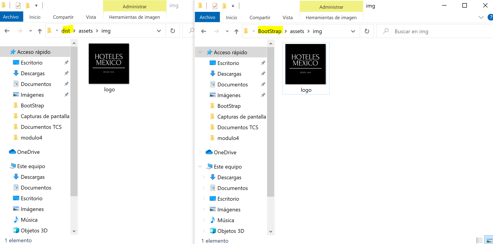</div>

Recordemos que rimraf es como un borrado profundo. Cuando definimos `"clean":"rimraf dist"` le decimos que haga un borrado a profundidad de dist. Esto nos servirá cuando queramos generar una nueva versión distribuible y tenga que borrar lo de la versión anterior.

### Herramienta Usemin

Para instalar esta herramienta es necesario ingresar el siguiente comando en la consola `npm install --save-dev usemin-cli cssmin uglifyjs htmlmin` en esta herramienta se anda agregando **cssmin**, **uglifyjs** y **htmlmin** Esta herramienta nos permitirá configurar utilizando comentarios en nuestro html la tarea de minificar y ofuscar los archivos CSS, JS y paquetes de archivos.

* **Minificacio** Es la eliminación de caracteres redundantes que no aporten valor, esto nos permitirá reducir el espacio del archivo. Además permite unificar archivos en uno sólo. Además tambien sirve para el versionado y evitar el caché.

* **Uglify** nos permite ofuscar todos los JS y CSS, se cambian caracteres, se quitan espacios y a su vez dificulta la lectura. También dificulta a un instruso utilizar nuestros archivos JS o CSS.

#### Definiendo las tareas

Para utilizar `usemin` es necesario definir la siguiente tarea:

`"usemin":"usemin index.html -d dist --htmlmin -o dist/index.html"`

El `-d` sirve para indicar el destino. Y las `--` flags son todas las tareas a hacer.
Esto hay que repetirlo para todas las paginas.

La tarea final quedaría de la siguiente manera, anidando todas las páginas que queremos minificar:

`"usemin":"usemin index.html -d dist --htmlmin -o dist/index.html && usemin about.html -d dist --htmlmin -o dist/about.html && usemin prices.html -d dist --htmlmin -o dist/prices.html && usemin contact.html -d dist --htmlmin -o dist/contact.html"`

Una vez que definimos esta tarea tambien es necesario indicar las reglas del `usemin` dentro de nuestro HTML.

| Comentario | Accción |
| --- | --- |
| `<!--build:css dist/index.css-->` | Le indicamos que haremos un CSS de lo indicado y la dirección a donde lo queremos mandar. |
| `<!--build:js dist/index.js-->` | Le indicamos que haremos un JS de lo indicado y la dirección a donde lo queremos mandar. |

Con estos comentarios estamos diciendole a la herramienta que observe el archivo, ver donde tiene los tags de **JS ó CSS** y armar un archivo sólo con los archivos contenido entre el **build**.

**Nota:** Es una excelente práctica no tener código escrito dentro de las páginas.

Estos pasos y tag's deberemos repetirlo en todas y cada una de las páginas que queremos mandar a producción.